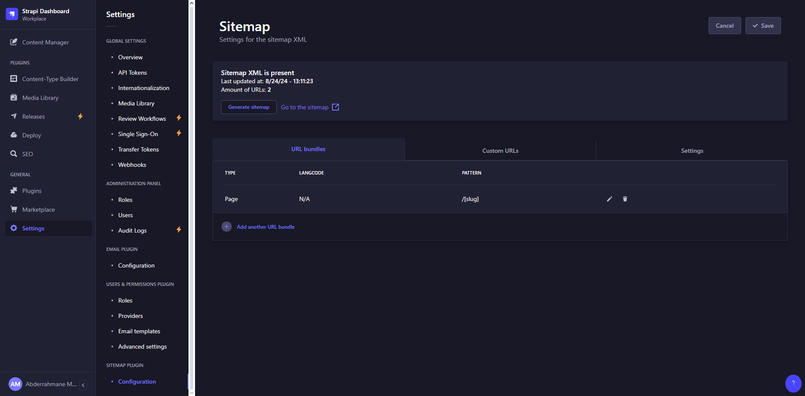
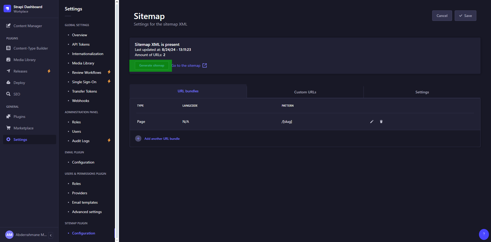

# Configure your sitemap

You need to know the sitemap part is generated by the CMS (Strapi) with [strapi-plugin-sitemap](https://market.strapi.io/plugins/strapi-plugin-sitemap)
You can find a tutorial on how to specificaly configure your sitemap here : <https://market.strapi.io/plugins/strapi-plugin-sitemap>

## Table of Contents

- [Configure your sitemap](#configure-your-sitemap)
  - [Table of Contents](#table-of-contents)
  - [Sitemap settings](#sitemap-settings)
  - [Sitemap Generation](#sitemap-generation)
  - [Test the sitemap](#test-the-sitemap)
  - [Submit your sitemap to search engines](#submit-your-sitemap-to-search-engines)

## Sitemap settings

1. Access the plugin settings :
   - Open your Strapi admin panel (usually accessible at **<http://localhost:1337/admin>**).
   - Navigate to the **Settings** section.
2. Configure the sitemap plugin :

   - In the Settings menu, you'll find the Sitemap plugin under the Plugins section.
   - Here, you can configure various options such as **which content types** should be included in the sitemap, custom URLs, and more. (I already setup for **Pages**)

   Some of the configurations you might see include:

   - Include/Exclude Content Types: Choose which content types should be included in the sitemap.
   - Custom URLs: Add any custom URLs that should be included in the sitemap.
   - Frequency & Priority: Set the changefreq and priority attributes for each content type.

3. Save your settings :
   - Once you've configured the plugin, save your settings.

## Sitemap Generation

You can generate your sitemap in 2 ways :

1. CLI
   To generate the sitemap with CLI you can just run `yarn sitemap:generate`

2. Via Web Interface
   With the "Generate sitemap" button : <http://localhost:1337/admin/settings/sitemap>
   

## Test the sitemap

Once the sitemap is generated, you can test it using various online tools like the Google Search Console or Bing Webmaster Tools. These tools will validate your sitemap and ensure it’s properly formatted.
You should also go to the sitemap url to check if it work : <http://localhost:1337/api/sitemap/index.xml>
Replace **localhost:1337** by your strapi domain.

## Submit your sitemap to search engines

All those settings is to be discover by search engines. That's why you would want to submit it to Google & Bing

For Google :

1. Google Search Console <[search.google.com/search-console](https://search.google.com/search-console/welcome)>:
   - Go to Google Search Console.
   - Select your property and navigate to the Sitemaps section.
   - Enter the URL of your sitemap and submit it.

For Bing :

1. Bing Webmaster Tools <[bing.com/webmasters/about](https://www.bing.com/webmasters/about)>:
   - Log in to Bing Webmaster Tools.
   - Go to your site's dashboard and find the Sitemaps section.
   - Submit the URL of your sitemap.
